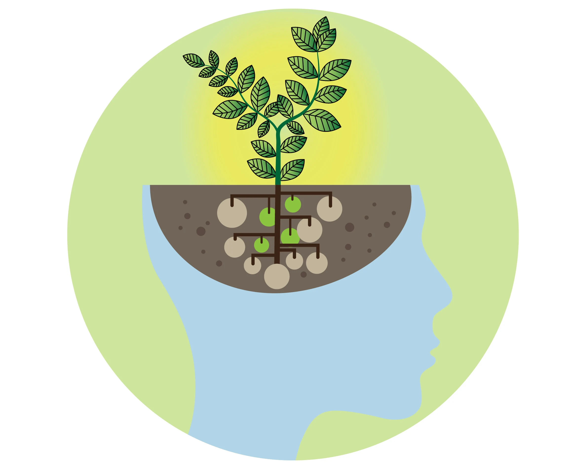

## Growth mindset

A growth mindset allows you to approach life with optimism, embrace challanges,  
continuously learn and improve, and adapt to changing circumstances. It empowers you to  
reach your full potential and make the most out of opportunities that come your way.

### How to i keep my self in growth mindset?

**1. Challanges:** There will be a lot of challenges. I have to embrace the learning process, view at the challenges as opportunities. I need to understand that coding is a skill, and it takes time to learn.  

**2. Obstacles:** I have to learn how to overcome obstacles. There is no short cuts to success. The road never be straigt, there always be some obstacles. 

**3. Effort:** I need to put a lot of effort to gain a results i want. No excuses! 

***

### About

> My name is Vaidas. I am passionate IT enthusiast with a keen interest in blockchain and AI technologies.  
> I am constantly seeking for opportunities to gain more knowledge in these fields.  
> With a passion for IT, i am a dedicated learner, who stays up-to-date on the latest trends. 
> Additionaly, i am highly enthusiastic about AI and blockchain technologies. Actively exploring decentralized  
> applications.

Click [here](https://github.com/MisterVaidas) to access my GitHub profile
